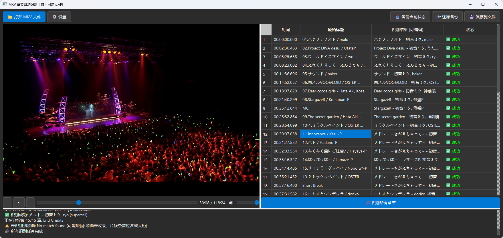

# MKV 章节自动识别与重命名工具 (AutoClipByMusicRecognition)

这是一个强大的工具，用于自动识别 MKV 视频文件中每个章节的背景音乐，并将章节名称自动更新为"歌名 - 歌手"格式。

本项目基于网易云音乐的音频指纹技术，支持图形用户界面 (GUI) 和命令行 (CLI) 两种操作模式。



## ✨ 功能特性

*   **🎵 自动识别**: 使用先进的音频指纹技术，精准识别章节内的歌曲。
*   **🖥️ 图形界面**: 提供现代化的 GUI 界面，支持视频预览、章节跳转、手动编辑和批量操作。
*   **⚡ 批量处理**: 支持对多个章节进行一键自动识别。
*   **🛠️ 高度可配**: 支持自定义采样位置（开头/中间/结尾）、采样时长和重命名模板。
*   **🛡️ 安全可靠**: 内置备份与还原功能，随时可以恢复到原始章节状态。
*   **📝 灵活模板**: 支持多种命名格式，如 `{name} - {artists}` 或 `{name} ({trans_name})`。

## 📦 依赖要求

在运行本程序之前，请确保您的系统已安装以下工具：

1.  **FFmpeg**: 用于音频提取。
    *   [下载 FFmpeg](https://ffmpeg.org/download.html)
2.  **MKVToolNix**: 用于章节提取和写入 (`mkvextract`, `mkvpropedit`)。
    *   [下载 MKVToolNix](https://mkvtoolnix.download/downloads.html)

请确保这些工具已添加到系统的 PATH 环境变量中，或者在程序的设置中指定其路径。

## 🔧 安装与运行

### 方式一：直接运行源码 (推荐开发者)

1.  **克隆仓库**
    ```bash
    git clone https://github.com/your-username/AutoClipByMusicRecognition.git
    cd AutoClipByMusicRecognition
    ```

2.  **安装 Python 依赖**
    需要 Python 3.10+
    ```bash
    pip install PySide6 pythonmonkey pyncm requests
    ```

3.  **启动 GUI**
    ```bash
    python mkv_chapter_gui.py
    ```

### 方式二：编译为可执行文件 (EXE)

如果您希望生成无需 Python 环境即可运行的 `.exe` 文件：

1.  安装 PyInstaller:
    ```bash
    pip install pyinstaller
    ```

2.  运行构建脚本:
    ```bash
    python build_exe.py
    ```

3.  编译完成后，可执行文件位于 `dist/` 文件夹中。

## 📖 使用指南

### GUI 模式
1.  运行 `MKVChapterGUI.exe` 或 `python mkv_chapter_gui.py`。
2.  点击 **"📂 打开 MKV 文件"** 加载视频。
3.  在右侧列表中查看章节信息。
4.  点击 **"⚙️ 设置"** 调整识别策略（如采样偏移量）和命名模板。
5.  点击 **"🎵 识别所有章节"** 开始自动处理。
6.  识别完成后，您可以手动双击单元格修改标题。
7.  点击 **"💾 保存到文件"** 将更改写入视频文件。

### 命令行模式 (CLI)
适合脚本自动化或批处理。

```bash
# 基本用法
python auto_rename_mkv_chapters.py video.mkv

# 自定义采样偏移（从章节开始后 10 秒采样）
python auto_rename_mkv_chapters.py video.mkv --offset 10

# 使用自定义模板
python auto_rename_mkv_chapters.py video.mkv --template "{name} by {artists}"
```

## 📄 许可证

本项目采用 **GNU GPL v3.0** 许可证。
核心识别功能依赖于 [ncm-afp](https://github.com/mos9527/ncm-afp) 和 [pyncm](https://github.com/greats3an/pyncm)。

---
*注意：本工具仅供学习和个人使用，请勿用于非法用途。*
